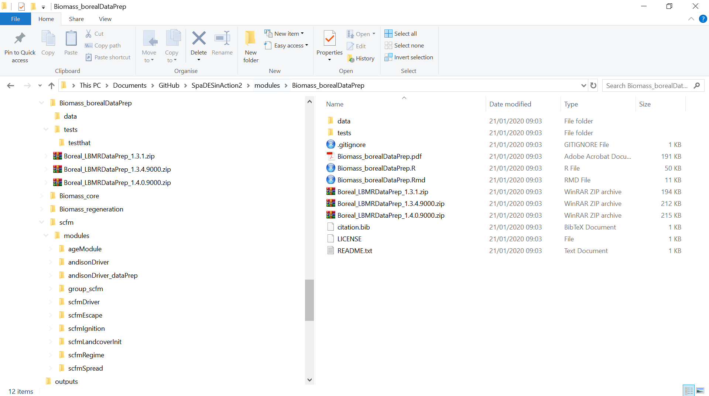

```{r setup, include=FALSE}
knitr::opts_chunk$set(echo = TRUE, eval = FALSE)
library("SpaDES")
```

Now let's create a new module and explore its (1) structure, (2) anatomy, (3) features, and (4) development.

The models we want to use for our simulations are composed of one, or several SpaDES modules. Both `LandR` and `scfm` are composed in this example of three modules, while then `caribouRSF` is defined as just one module. The central role of a module is to ensure the *scheduling of events*, which can perform any tasks the user needs: get data, resolve an equation, run GIS operations, perform statistis and simulations, create a webapp, and anything else one can imagine. In our workflow, we have mostly been using each module as its own online (i.e. `github`) repository, but in some cases, a collection of modules can be placed as its own repository (i.e. `scfm`)

## 1. Structure of a `SpaDES` module

When a new module is created using the function 
``` 
newModule(name = "exampleModule", path = tempdir())
``` 
a the structure of folders and files is created:

```
/modules
  |_ exampleModule/
      |_ R/                     # contains additional .R (helper) files/functions
      |_ data/                  # directory for all included data
          |_ CHECKSUMS.txt      # contains checksums for data files
      |_ tests/                 # contains unit tests for module code
      |_ citation.bib           # bibtex citation for the module
      |_ LICENSE.txt            # describes module's legal usage
      |_ README.txt             # provide overview of key aspects
      |_ exampleModule.R           # module code file (incl. metadata)
      |_ exampleModule.Rmd         # documentation, usage info, etc.
      |_ exampleModule_x.y.z.zip   # zip archive of previous versions
```


The `data` folder created is generally used as a module's default destination path for new files that are downloaded by the module in question. The `tests` folder is the place for adding unit tests for the module so updates and enhancements can be properly tested before the module is uploaded and shared. Suggestions on unit tests can range from the correct type of inputs, to combinations of different parameters, and so on. The first file we see is a `.gitignore`, which should be edited to ensure that big data (i.e. > 50Mb) is not uploaded to the module's online repository (i.e. `github`). Any folders or files added to the `.gitignore` will not be available to be commited and pushed to online repositories.  

The next file we see is a `.pdf` generated from the rendering of the `.rmd` file, with the documentaion of the module. A template of the `.rmd`is created upon the creation of the module, and can be used to guide the module developer on important information that should be disclosed to module's users. Some more mature modules can also have zipped files of previous module versions. The function  `newModule()` will also create a citation file in `bibtex` format, a license file and a README.txt file that should be used for general information on the module. This file is used in the github repository's webpage.  

At last, we have the module's `.R` script, which is the SpaDES module itself, which we will cover in the next section.

Some modules that are expected to work together can be connected by a grouping (or parent) module. Different parent modules can also be connected by a grandparent module. The only counterintuitive detail is on the parallel structure these modules will be presenting in the module's folder:  

```
modules/
  |_ childModuleA1/
  |_ childModuleA2/
  |_ childModuleB1/
  |_ childModuleB2/
  |_ grandparentModule/
  |_ parentModuleA/
  |_ parentModuleB/
```

Grouping modules will ensure that if the user runs the parent or grandparent module, all children and grandchildren modules will be run, _and in the specified order_. More details on sharing and using existing modules can be found 
[here](https://spades-workshops.predictiveecology.org/articlesOct2019/08-Sharing_Modules.html).


## 2. Anatomy of a `SpaDES` module

A module code file (`.R`) consists of the following key sections:

1. module metatadata (`defineModule` block)
2. definitions of each module event type (`doEvent.moduleName` block)
3. additional functions used in the events above OR nothing (functions can be added as separate scripts to the R folder created, which is sourced when a module is set to run)
4. (optional) block of code that is run during module initialization, used to perform additional data processing/transformation steps (`.inputObjects` block)

Alternatively, use the RStudio addin which is simply a GUI wrapper for this function:


### Module metadata

Each module requires a collection of metadata describing the module, its dependencies, and linking to documentation, etc.

These metatadata are defined in the `defineModule` code block at the start of the file, and are intended to be both human and machine readable.

```{r metadata, echo=TRUE, eval=FALSE}
## see section 'Required metadata elements'
?defineModule
```

### Module parameters

*Parameters* defined in the module's `defineParameter` block are module-specific.

This is where default parameter values are specified (which can be overridden by the user during `simInit()`).

They can be accessed using `params(sim)$module$param` or `P(sim)$param`.
**The latter is context-dependent!**

#### Data dependencies

The `inputObjects` and `outputObjects` metadata fields specify a module's inputs and outputs respectively.

**These refer to R objects, rather than raw data files.**

#### Working with data

- data can be bundled directly with your module or can be hosted externally
- `sourceURL` field in module metadata is used for URLs of external data, which are downloaded using `downloadData()`
- checksums are to verify file integrity of the data (*e.g.*, in case of download error or change in the data file)

### Module events

- Each module may contain an arbitrary number of event types.
- Each event consists of two parts:

    1. what to do right now;
    2. what to do later (via `scheduleEvent()`)

- To keep this section as easy to read as possible, use additional module functions (defined in the section below).

### Additional module functions

- Should get and return objects in the simulation environment (`envir`), rather than pass them as function arguments.
- Accessing objects in `envir` is similar to accessing items in a list, *i.e.*, `sim[["object"]]` or `sim$object` can be used.
- To ensure unique function names, follow the naming convention `modulenameEventtype()`.

### The `.inputObjects` block (*optional*)

- How do we provide default data for a module?

- Once we have defined what the module is looking for (in the `inputObjects` block of `defineModule`), we may want to supply a default data set or links to raw data sources online

- See `?defineModule` and `?inputs` for details.
- Sequence to fill simList with data, each subsequent one will override the previous:

1. `.inputObjects` function in module
2. `objects` argument in `simInit`
3. `inputs` argument in `simInit`

- *So remember if the user passes data manually in the `simInit`, it will override the defaults*

We will revise and go a bit deeper into the a module's anatomy when we discuss [static](https://htmlpreview.github.io/?https://github.com/CeresBarros/SpaDES4Dummies/blob/master/SpaDES4Dummies.html) and [dynamic](HTML_address_to_looping+convertingR) modeling.

## 3. Features

### Visualizations

`SpaDES` builds on R's exceptional graphics capabilities, and the standard R visualization packages etc. can be used with `SpaDES`.

However, for fast prototyping and on-the-fly graphics useful for module debugging and development you should use `Plot()`.

    - much faster than base graphics, ggplot, etc.
    - modular plotting (automatic multipanel layouts)

**WARNING:** The built-in RStudio plotting device is heinously slow!

```{r new-plot-device, echo=TRUE, eval=FALSE}
if (getOption('device') == 'RStudioGD') dev.useRSGD(FALSE)
dev()
```

### `Plot`ting

See the [plotting vignette](http://spades.predictiveecology.org/vignettes/iii-plotting.html) and `?Plot` for more detailed examples.

```{r Plotting, echo=TRUE, eval=FALSE}
Plot(...)
clearPlot()

Plot(..., new = TRUE)
Plot(..., addTo = objectName) ## adds to existing plot

rePlot() ## useful after plot device is resized

## see also
colors(...) ## get and set raster colors
```

### Event-level plotting

Module-specific plot parameters can be used to control plotting for your event: `.plotInitialTime` and `.plotInterval`.

*E.g.*, schedule a recurring plot event within a module:

```{r plotting, echo=TRUE, eval=FALSE}
nextPlot <- time(mySim) + SpaDES::p(mySim)$.plotInterval
mySim <- scheduleEvent(mySim, nextPlot, "moduleName", "plot")
```

### Interacting with plots

See http://spades.predictiveecology.org/vignettes/iii-plotting.html#interacting-with-plots

- `clickValues()`
- `clickExtent()`

### Saving

- http://spades.predictiveecology.org/vignettes/ii-modules.html#load-and-.save-modules

    - `.saveObjects`
    - `saveFiles()`

*E.g.*, schedule a recurring save event within a module:

```{r saving, echo=TRUE, eval=FALSE}
nextSave <- time(mySim) + SpaDES::p(mySim)$.saveInterval
sim <- scheduleEvent(mySim, nextSave, "moduleName", "save")
```

### Loading

- http://spades.predictiveecology.org/vignettes/ii-modules.html#load-and-.save-modules

### Checkpointing

Checkpointing is build into `SpaDES` automatically and can be turned on at the *simulation* level (not the module level).

```{r checkpoint, eval=FALSE, echo=TRUE}
parameters <- list(
  .checkpoint = list(interval = 10, file = "chkpnt.RData")
)

mySim <- simInit(..., params = parameters)
```

See [vignette](http://spades.predictiveecology.org/vignettes/ii-modules.html#checkpoint-module
) for more details.

**NOTE** don't checkpoint *too* often, or your simulation will slow down too much (disk writes are slow).

## 4. Development

This section was written to help with module development either during, or after the workshop. We won't cover it right now, but some of the concepts and examples here will be brought up later on.

### Debugging

- using `spades(sim, debug = TRUE)`

- adding `browser()` calls to your module code

- using the Rstudio debugger

See debugging info at the [wiki](https://github.com/PredictiveEcology/SpaDES/wiki/Debugging).

### Summary statistics

See [this wiki entry](https://github.com/PredictiveEcology/SpaDES/wiki/Summary-statistics-in-simulations).

1. Add a new module parameter and output to the module metadata.

2. Add a 'summarize' event.

3. Add an new event function that calculates the statistic(s) of interest.

4. Update your module's `reqdPkgs` metadata field if you are using additional packages.

## Module development checklist

\*Adapted from the [one on the wiki](https://github.com/PredictiveEcology/SpaDES/wiki/Getting-Started-Guide#module-development-checklist).

#### Metadata

- [ ] are module metadata fully and correctly specified (module description, authorship and citation info, parameters and inputs/outputs, etc.)?
- [ ] citation should specify how to cite the module, or if published, the paper that describes the module.
- [ ] module object dependencies: use `moduleDiagram` and `objectDiagram` to confirm how data objects are passed among modules.

### Module development checklist

\*Adapted from the [one on the wiki](https://github.com/PredictiveEcology/SpaDES/wiki/Getting-Started-Guide#module-development-checklist).

#### Events

- [ ] are all event types defined in doEvent?
- [ ] use `sim$function(sim)` to access event functions
- [ ] `use sim$object` to access simulation data objects
- [ ] use *e.g.*, `sim[[globals(sim)$objectName]]` to access variable-named objects
- [ ] use unique function names to reduce the risk of another module overwriting your functions. *E.g.*, use `moduleNameFunction()` instead of `function()`.
- [ ] using `sim$function` notation is not required for the definition of event functions

### Module development checklist

\*Adapted from the [one on the wiki](https://github.com/PredictiveEcology/SpaDES/wiki/Getting-Started-Guide#module-development-checklist).

#### Documentation

- [ ] have you provided useful (meaningful) documentation in the module's `.Rmd` file and `README`?
- [ ] have you built (knitted) the `.Rmd` file to generate a `.pdf` or `.html` version?
- [ ] have you specified the terms under which your module code can be reused and/or modified? Add a license!

### Module development checklist

\*Adapted from the [one on the wiki](https://github.com/PredictiveEcology/SpaDES/wiki/Getting-Started-Guide#module-development-checklist).

#### Data

- [ ] verify that data you wish to include with your module are saved in `data/`
- [ ] verify that external data sources are included in the `sourceURL` metadata field
- [ ] verify that any additional data preparation/transformation steps used in `.inputObjects` are correct
- [ ] write `CHECKSUMS.txt` file for all data using `checksums(..., write = TRUE)`

### Module development checklist

\*Adapted from the [one on the wiki](https://github.com/PredictiveEcology/SpaDES/wiki/Getting-Started-Guide#module-development-checklist).

#### Distributing your module

- [ ] where will your module code/data be hosted?
- [ ] test `downloadModule` and `downloadData` from a temp dir to ensure your module can be downloaded correctly by others
