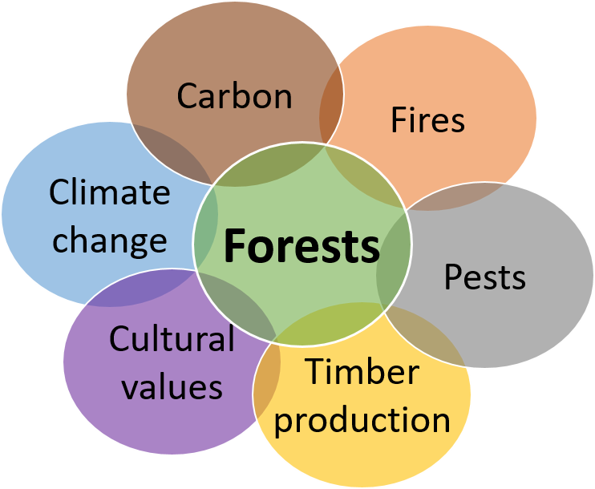

```{r setup, include=FALSE}
knitr::opts_chunk$set(echo = TRUE, eval = FALSE)
```

## Introductions

- name, bio, etc.
- what have you heard about `SpaDES`?
- have you used it?
- what excites you the most about learning it?

## Workshop goals

- day 1: broad overview and introduction to `SpaDES`
- day 2: model implementation in `SpaDES`
- day 3: define you `SpaDES` modelling needs, and start working on your module(s)

## Why is modelling important?

Models are nowadays so important and widespread that we often don't realize that most of what we use in our daily lives is the result of someone's (or some team's) model.
From weather forecasting, to predicting stock market fluctuations.
From the design of your bike, to the estimation of blood sugar and insulin levels and how they vary hourly and according to different diets (in case you don't know, this can be important for diabetes treatments, and drug dosage and scheduling)... 

## Models are 'everywhere'


## Challenges modellers face  

In a world where disciplines often interact to study complex questions, like climate change, natural resource management, or even where to build an offshore wind farm, modellers (and model users!) face challenges that can impair scientific and social progress:

## 1. Many models, low integration

- different scientific teams/individuals develop models to investigate the same question - which to choose?
- these models sometimes vary in their degree of complexity - when is one more appropriate than the other?
- and are often written in different programming languages, sometimes making their comparison, integration and development harder (especially for those who are not the model authors!)  

## 2. High complexity

- often solving a question, or problem, requires the cooperation of different teams, each contributing with distinct data and, possibly, models that need to be integrated;




## 3. Era of *big data*

- data availability and volume are increasing *FAST*;
- today's model, will be outdated tomorrow -> models need to be constantly updated, revised and re-validated and re-calibrated.

## 4. Reproducibility and transparency

- one of the first premisses of scientific method is to repeat analyses and verify whether hypotheses hold in different conditions -> science *must* be reproducible in order to progress;
- models (and modellers!) should be open to change and adaptation;
- results and conclusions *must* be shared with stakeholders, managers, policy makers and the general public.

## How do we tackle these issues?
  
*Continuous adaptive management* is an existing framework that assumes a periodic re-assessment of the status of a situation or issue, e.g. the amount of waste a company produces.
This leads to the design and implementation of new solutions - e.g. recycling paper or using rain water - their monitoring and evaluation, and their adjustment if need be, before the next assessment.  
  
In modelling terms, this framework implies that for a given problem/question analyses and forecasts are repeated as new data, new methodologies and new or improved models arise.
This can lead to a re-assessment of risk, inform decisions and influence policy making.
These can in turn feedback into the process of re-framing the initial problem/question.  
  
Although this framework is ideal, it is only seldomly applied across the scientific community.

Why? Because we are yet far from developing our research in a way that is easily repeatable, "upgradeable" and shareable.
This renders the application of the continuous adaptive management framework costly, both temporally and financially, especially in interdisciplinary projects that involve multiple teams and stakeholders.

  

## Where do we go from here?


## What is `SpaDES`?

*Spa*tial *D*iscrete *E*vent *S*imulator - is a modelling framework in the form of an ensemble of `R` packages.
It aims to provide modellers and non-modellers across different domains of life and earth sciences (and beyond!) with a modelling tool that they can *control*, *apply* and *develop*.
In its whole, `SpaDES` bridges the gaps between modellers and model-users of different disciplines, between scientists, practitioners, managers, stakeholders and policy makers, and between scientists and the general public.  

## How?

1.  `SpaDES` is written in `R`: a widely understood programming language, highly suited to statistical analyses, but flexible and fast enough to accommodate simulation work;  
2.  `SpaDES` can be used for a wide-range of modelling approaches:
    + process-based models;
    + phenomenological models;
    + spatially-explicit models;
    + ...
3. `SpaDES` models are built of *modules*, i.e. self-contained, interacting pieces that execute a particular *event*, or process in the model;
4. `SpaDES` modules can be made available across the entire `R` community if module-developers wish it so;
5. `SpaDES` will soon include a web-app builder to make interactive simulation possible.  

Like a smart-phone where users install and use the apps that they want, `SpaDES` can be seen as a platform where a model can be "assembled" from various pre-made modules. This allows non-modellers to run someone else's model on *their* data and *their* parameters, and, on the other hand, it allows modellers write their own modules from scratch, run them and share them with the `R` user community.  

## **An example**
Our question(s): how will forest fires affect forest age? And how will climate change affect fire regimes and in turn the vegetation? How will timber supply be affected?  


## To start we'll need...

- a vegetation dynamics module - e.g. [forestAge](https://github.com/PredictiveEcology/SpaDES-modules/tree/master/modules/forestAge);
- a fire simulator - e.g. [forestSuccessionBeacons](https://github.com/PredictiveEcology/SpaDES-modules/tree/master/modules/forestSuccessionBeacons) modules;
- optional:
    +   the interaction between fire and vegetation
    +   statistical analyses/presentation of results  

Depending on how modules are built, the interaction between modules may or may not require additional modules.
Similarly, the presentation of results and their analyses can be directly made within the module producing them, or *as posteriori* using another module.
Your call.
`SpaDES` is all about flexibility!  

Using the above mentioned modules would already allow an analysis of how fires affect forest age, and vice-versa.

## Then add climate-change, timber supply models...

Analysing the effects of climate change could then be done by varying fire-related parameters (e.g. frequency and intensity of fires) in a simulation experiment. Alternatively, an additional module could simulate climate change effects, which would feedback unto both fire parameters and vegetation.  
Finally, a timber supply module could "read" the vegetation maps produced after fire simulations and calculate timber quantity and quality from forest conditions (e.g., surviving tree species and their age).

## Reserve, add new data, and re-run
Provided that modules are able to download, read and treat data adequately, updating the simulations for new data is easy.
`SpaDES` comes with a set of functions (via the `reproducible` package) that enable caching model structure, parameters and simulation results.
This way, if new data only affects a section of the model, the user won't have to repeat every step to update the simulations.  

## Decorate and serve
Because models are not just for modellers, a shiny app building package is being developed to transform any `SpaDES` simulation into a web-app. This provides an interactive way of visualising results, as users can change simulation parameters and turn modules on and off, whilst observing how this impacts simulation results. Importantly, it can be particularly useful when conveying results to a non-expert or even the public.  

## `shiny` web-app demos

- <https://spades.shinyapps.io/ForestChange_ProofOfConcept/>
- <http://landweb.ca>

## Exercises. Getting started with `SpaDES` in `R`

Make sure R, Rstudio, `SpaDES` are all installed.

## 1.2 Modules included in the `SpaDES` package

```{r sampleModuleDir}
## load SpaDES
## RESTART R -- using Ctrl-Shift-F10 (may work if in Rstudio) or other
library(SpaDES)

## Locate the sample modules in SpaDES.core
sampleModuleDir <- system.file('sampleModules', package = 'SpaDES.core')
    
## list the modules in this directory
dir(sampleModuleDir)
```
  
**What do these modules do?**  

```{r sampleModuleFiles}
## open the sample module Rmd file to learn more about the modules and access a simple example
sampleModuleFiles <- list.files(sampleModuleDir, pattern = 'Rmd$', recursive = TRUE, full.names = TRUE)

## open the Rmd file
file.edit(sampleModuleFiles)
```
  
As a best practice, modules should come with an *.Rmd* file that provides a summary of how the module works and *reproducible* example, though this is not actually imposed.
If you've ever searched for R-help on **stackoverflow** you'll have noticed how people try to provide `R` code that can be run in any machine to reproduce the problem/solution at hand.
Module *.Rmd* files should also run in any machine.
  
### 1.3 Simulation modelling with `SpaDES`

Let's go back to the modelling question discussed briefly above.  

Our first objective is to simulate the effect of fire on forest age. There are two main components to such a model, which need to interact:  

1. a fire simulator;
2. a forest age simulator.

#### 1.3.1 Download modules

The `LCC2005` module group provides a set of modules that can reproduce these dynamics (in a simple way).  

Let's define the working directories of our simulation exercise (*SpaDESintro*) first.  

```{r def_dirs}
main.dir <-  "~/temp_SpaDESws"

## We'll create the necessary directories in a temporary location - feel free to change this if you wish to.
setPaths(cachePath = file.path(main.dir,'cache'),
         inputPath = file.path(main.dir, 'inputs'),
         modulePath = file.path(main.dir, 'modules'),
         outputPath = file.path(main.dir, 'outputs'))

## verify that this is want you wanted:
getPaths()
```

Now we'll get `LCC2005` modules needed and save them in the `modules` folder created before. If you already have done this before and want to do it again, set the `overwrite` argument to `TRUE`.  

```{r module_downld}
## note how we use the modules folder defined above and chose to download the necessary data
downloadModule('LCC2005', path = getPaths()$modulePath, repo = 'PredictiveEcology/SpaDES-modules', overwrite = TRUE)
```

Now we can download the data needed for the modules.

```{r data_downld}
downloadData("LccToBeaconsReclassify") # 41 MB file
```

But what happens if the module doesn't require any data?
Let's try to download data for any other module that doesn't need data. 

In the next block, why does the second one re-download the same dataset as we just downloaded?

````{r data_notReq}

downloadData("fireSpreadLcc") # Note it will hit the error "Error in curl::curl_fetch_memory(url, handle = handle) : Could not resolve host: NA".

downloadData("cropReprojectLccAge") # Note that there is an error in the end of this download (at the last file). "Could not resolve host: ftp.daac.ornl.gov". This is related to a missing map that we will fix below
```

Unfortunately, the forest age raster (`can_age04_1km.tif`) is no longer downloadable without creating an account on the NASA EarthData website.
We have provided a copy, which you can download from [here](https://drive.google.com/file/d/1bD957dewv3U-cbISfeUEz1QpGg5DurR-/view?usp=sharing) and put in `file.path(getPaths()$modulePath, "cropReprojectLccAge/data")` and `file.path(getPaths()$modulePath, "modules/forestAge/data")` (this will only be possible during the workshop).
However, downloading objects/files from the internet is a common problem.
To enhance reproducibility, the function will not download a file again if it has a local copy:

```{r prepInputs}
# downloads
age <- prepInputs(url = "https://drive.google.com/file/d/1bD957dewv3U-cbISfeUEz1QpGg5DurR-/view?usp=sharing",
                  destinationPath = file.path(getPaths()$modulePath, "cropReprojectLccAge/data"))

# doesn't download, because it is already there -- uses Checksums
age <- prepInputs(url = "https://drive.google.com/file/d/1bD957dewv3U-cbISfeUEz1QpGg5DurR-/view?usp=sharing",
                  destinationPath = file.path(getPaths()$modulePath, "cropReprojectLccAge/data"))

file.copy(raster::filename(age),
          file.path(getPaths()$modulePath, "forestAge/data"))
```

For future reference, it is possible to create an account on the NASA EarthData website and, after logging in, you'll find the file [here](https://daac.ornl.gov/NACP/guides/NA_Tree_Age.html).  

```{r open_mdl}
## open the description of the LCC2005 module group - on Windows this doesn't work because of an Rstudio issue, instead the message provides the lines to copy and paste
openModules('LCC2005', path = getPaths()$modulePath) 

## list all module files within LCC2005 and open them
LCC2005ModuleFiles <- list.files(getPaths()$modulePath, pattern = 'Rmd$', recursive = TRUE, full.names = TRUE)

## open module Rmd files
file.edit(LCC2005ModuleFiles[1])
lapply(LCC2005ModuleFiles, file.edit)
```
  
As you can see, `LCC2005` is a module group, meaning that it contains several modules that work together.
Find more about module groups [here](http://spades-workshops.predictiveecology.org/articles/03a-Existing-modules.html#parent-modules-a-k-a--module-groups).  

In this exercise, we will follow a simplified version of the example contained in the `LCC2005.Rmd` file.
We will only use the modules necessary to simulate vegetation dynamics (`cropReprojectLccAge`, `forestAge`, `forestSuccessionBeacons` and `LccToBeaconsReclassify`) and fire spread (`fireSpreadLcc`).  

#### 1.3.2 Simulation setup

```{r LCC2005_setup}
## We've defined the paths earlier 
paths <- getPaths()

## we'll use several, but not all the modules in LCC2005
modules <- list("cropReprojectLccAge", "fireSpreadLcc", "forestAge", "forestSuccessionBeacons", "LccToBeaconsReclassify")

## we don't need to supply external objects
objects <- list()

## define the starting and end times of the simulation
times <- list(start = 1.0, end = 20.0)

## define parameters. This will override any default parameters during this simulation.
parameters <- list(
  .globals = list(stackName = "landscape", burnStats = "nPixelsBurned"),
  .progress = list(NA),
  fireSpreadLcc = list(nFires = 10L, drought = 1, its = 1e6,
                    persistprob = 0, returnInterval = 1, startTime = 1,
                    .plotInitialTime = NA, .plotInterval = 10)
)

## list parameters
ls.str(parameters)

## make simulation object
mySim <- simInit(times = times, params = parameters, modules = modules,
                 objects = objects, paths = paths)
```
  
#### 1.3.3 Simulation object - `simList`

The object `mySim` contains all the necessary information to run the simulation, such as the objects that are shared between modules, and how these are linked between them. It's called a `simList`.
You can find out more about the `simList` object [here](http://spades-workshops.predictiveecology.org/articles/05a-The-simList.html).  

Let's have a look at what `mySim` contains and how modules are connected.  

```{r mysim}
## list the contents of mySim
ls.str(mySim)

dev()
mySim$age[] <- mySim$age[]
Plot(mySim$age, title = "National age map") # usually faster than plot(mySim$age)

## plot module connections
dev()
objectDiagram(mySim)

## see which events are scheduled
events(mySim)
```

You'll note that `SpaDES` has scheduled the initialisation events for each module. 

#### 1.3.4 Running a `SpaDES` simulation

Now that we've checked the structure of our simulation model, we can go ahead and run it.  

```{r run_spades}
dev() # to open a new plot device for faster plotting
clearPlot()
mySim2 <- spades(mySim, debug = TRUE)   # set debug = TRUE to print simulation steps.

## After running the simulation, we can print the event diagram, the completed events and the scheduled events
eventDiagram(mySim2)
completed(mySim2)
events(mySim2)
```


#### 1.3.5 Change model parameters without restarting

With `SpaDES` it is possible to change a simulations' parameters and then continue running it. This is possible because, even though the simulation stopped at year 20, `SpaDES` has scheduled the "next" events (see the result of the `events` call above). Find out more about events and event scheduling [here](http://spades-workshops.predictiveecology.org/articles/05d-Loops-to-Events.html).  

What will happen if drought intensity increases and fires become more frequent?  

```{r run_sim2}
end(mySim2)    ## accesses the last year
end(mySim2) <- 50   ## add another 30 years to the end of the simulation. 
                    ## Alternatively use end(mySim2) <- end(mySim2) + 30

params(mySim2)$fireSpreadLcc$drought   ## accesses the current drought parameter value
params(mySim2)$fireSpreadLcc$drought <- 3   ## changes it
params(mySim2)$fireSpreadLcc$returnInterval  ## accesses the current fire return interval value
params(mySim2)$fireSpreadLcc$returnInterval <- 1  ## changes it

clearPlot()
mySim3 <- spades(mySim2, debug = TRUE)

time(mySim2) ## "current" time (i.e. the time at which the simulation finished)
time(mySim3)
```

#### 1.3.6 Add a friend's module

The second part of our question was to investigate how forest fires may affect harvesting.
The `LCC2005` module group does not contain any module that we can use for this, but that's OK, because we can get modules from other Git repositories.  

We will use an *extremely* simple module that maps areas that are adequate for forest harvesting in function of forest age (a parameter that the user inputs) and the type of forest that can be harvested (here, only coniferous forests).
This module, called `forestHarvest`, will be downloaded from a different repository "CeresBarros/forestHarvest-SpaDESmodule".
Learn more about downloading and sharing modules [here](http://spades-workshops.predictiveecology.org/articles/03a-Existing-modules.html).  

```{r harvest}
downloadModule(name = "forestHarvest", repo = "CeresBarros/forestHarvest-SpaDESmodule", path = getPaths()$modulePath, overwrite = TRUE)

## We've defined the paths earlier 
paths <- getPaths()

modules <- list("cropReprojectLccAge", "fireSpreadLcc", "forestAge", "forestSuccessionBeacons", "LccToBeaconsReclassify", "forestHarvest")

## we don't need to suply external objects
objects <- list()

## define the starting and end times of the simulation
times <- list(start = 1.0, end = 50.0)

## notice the new parameter list
parameters <- list(
  .globals = list(stackName = "landscape", burnStats = "nPixelsBurned"),
  .progress = list(NA),
  fireSpreadLcc = list(nFires = 10L, drought = 1, its = 1e6,
                    persistprob = 0, returnInterval = 10, startTime = 1,
                    .plotInitialTime = 0.1, .plotInterval = 10),
  forestHarvest = list(returnInterval = 5, harvAge = 50, startTime = 11, .plotInterval = 5)
)

## make simulation object
mySim_manag <- simInit(times = times, params = parameters,
                       modules = modules,
                       objects = objects, paths = paths)
dev()
moduleDiagram(mySim_manag)
objectDiagram(mySim_manag)

dev()
clearPlot()
mySim_manag2 <- spades(mySim_manag, debug = TRUE)
```


#### 1.3.7 Choose to save outputs without changing module code

It is possible to set `SpaDES` to save particular objects at a user-defined interval. For this, we need to change the `simInit` call to include the `outputs` parameter, where we define the objects to be saved, the saving interval, etc. Check the `R` help for `simInit` for more details.

```{r saveOutputs}
## Change simInit to include the outputs options
mySim_manag <- simInit(times = times, params = parameters,
                       modules = modules,
                       objects = objects, paths = paths,
                       outputs = data.frame(objectName = "ageMap", saveTime = seq(1, 50, by = 10)))
## Re-run the model
dev()
clearPlot()
mySim_manag2 <- spades(mySim_manag, debug = TRUE)

## Print the list of saved outputs
outputs(mySim_manag2)

## Read the first object (two)
ageMap01 <- readRDS(outputs(mySim_manag2)$file[1])

## Now you can visualise the saved map in any way you want
dev()
clearPlot()
Plot(ageMap01, title = "Stand age")
tble <- table(ageMap01[])
frq <- as.data.frame(tble)
names(frq)[1] <- "ageClass"
frq # Frequency of age distribution

hst <- hist(ageMap01[])
Plot(hst, title = "Age distribution")
```

Are there fewer areas that are appropriate for harvesting if fires become larger (i.e. drought is more severe)? 

```{r}
end(mySim_manag2) <- 100
params(mySim_manag2)$fireSpreadLcc$drought <- 3
dev()
clearPlot()
mySim_manag3 <- spades(mySim_manag2, debug = TRUE)
```


### 1.4 Show your `SpaDES` model to the world!

Soon `SpaDES` will have another package that will allow building web-apps from `simList` objects, so that simulation results can be visualised and changed interactively.
For now, you can play around with the proof-of-concept `shiny` app, but also with the real LandWeb project:

- https://spades.shinyapps.io/ForestChange_ProofOfConcept/
- http://landweb.ca/

### 1.5 Use Github.com
<!-- TODO: move elsewhere -->

We have shown, in this section, `downloadModule`.
It is good for people who are *using* modules, but who don't plan on *developing* modules. For that, we **should** use version control.
All the modules we looked at today can be *cloned* by going to the web page:

`https://github.com/PredictiveEcology/SpaDES-modules`

Also, some of these modules are their own repository, and so you can clone them directly from their own, e.g., `LandMine`:

`https://github.com/PredictiveEcology/LandMine`

<!-- TODO: streamline and add LandWeb/NWT -->

## Examples
 
1. The [demo modules](https://github.com/PredictiveEcology/SpaDES/blob/master/inst/sampleModules/SpaDES_sampleModules/SpaDES_sampleModules.Rmd) in the `SpaDES` package
  
    - [caribouMovement](https://github.com/PredictiveEcology/SpaDES/blob/master/inst/sampleModules/caribouMovement/caribouMovement.R)  
    - [fireSpread](https://github.com/PredictiveEcology/SpaDES/blob/master/inst/sampleModules/fireSpread/fireSpread.R)  
    - [randomLandscapes](https://github.com/PredictiveEcology/SpaDES/blob/master/inst/sampleModules/randomLandscapes/randomLandscapes.R)  
            
2. Simple forest dynamics model (with caribou) ([LCC2005](http://htmlpreview.github.io/?https://github.com/PredictiveEcology/SpaDES-modules/blob/master/modules/LCC2005/LCC2005.html))

3. SpaDES-Landis Biomass Succession

4. Wolf IBM ([wolfAlps](http://htmlpreview.github.io/?https://github.com/PredictiveEcology/SpaDES-modules/blob/master/modules/wolfAlps/wolfAlps.html))

5. A shiny app on shinyapps.io (*e.g.*, [Proof of concept](https://spades.shinyapps.io/ForestChange_ProofOfConcept/))

## 1. Demo modules in `SpaDES` package

- The [demo modules](https://github.com/PredictiveEcology/SpaDES/blob/development/inst/sampleModules/SpaDES_sampleModules/SpaDES_sampleModules.Rmd) are simple, proof of concept modules.

- There are 3 different types of modules:

    - Event (fireSpread)
    - Agent (caribouMovement)
    - Data generation (randomLandscapes)
    
- *How to find them:*

```{r SampleModuleFiles}
# Locate SpaDES on your computer; they are in the sampleModule folder
whereSpaDES <- find.package(package  = "SpaDES")
whereSamples <- system.file('sampleModules', package = 'SpaDES')
file.path(whereSamples, 'caribouMovement', 'caribouMovement.R') %>%
  file.edit()
```

## 2. Simple forest dynamics model

- More modules than `SpaDES` demo
- Vegetation component is simple, but data-driven (LCC 2005)
- Neither caribou, nor fire are data-driven
- During simulation, it shows:

    - maps 
    - data summary plots 
    - text legends
    - colour matching between map and histogram
    - modular plotting (each module is unaware of other plots)

## 2. Simple forest dynamics model

- Freely available from the [SpaDES-Modules](http://github.com/PredictiveEcology/SpaDES-Modules) repository
- This repository is intended to be like CRAN, but for `SpaDES` modules; 
  makes them easy to distribute to others
- *How to find it:*

```{r LCC2005ModuleFiles}
## specify where to save files
moduleDir <- file.path(tempdir(), 'SpaDES_modules')

## download all necessary modules
downloadModule('LCC2005', path = moduleDir, data = TRUE)

## look at module or helper .Rmd file
openModules('LCC2005', path = moduleDir) 
```

## 3. SpaDES-Landis Biomass Succession 

- This is a rewrite in R of a core LANDIS vegetation dynamics module
- Slightly different implementation, making it faster under many situations
- Cross-platform (LANDIS is Windows-only)
- Allows scientist easier access to code, *e.g.*, 

    - making growth climate sensitive
    - changing mortality functions
    - dividing up large problems into small parallel problems

- Not yet published
    
## 3. SpaDES-Landis Biomass Succession 

### Example results

- Features:

    - Shows a random location in western boreal forest
    - Uses shiny to make it an interactive web page
    - Shows maps
    - Data summaries
    - Pre-run results
    - Can be easily published online, once public:
    
         (top right)

## 3. SpaDES-Landis Biomass Succession 

### Running the app

```{r LandwebApp}
shiny::runApp("~/GitHub/LandwebApp/")
```


## 4. Wolf IBM (wolfAlps)

<div class="align-right" style="float:right; margin: 20px">
  
</div>
  
- Agent based model of demography and dispersal of wolves in the Italian Alps
- R port of the original SELES model that was used in (Marucco and McIntire 2010)
- Can run this on your computer, in R

## 4. Wolf IBM (wolfAlps)

- Features:

    - Incremental visuals
    - One module
    - Progress bar
    - Caching (automatic saving)
    - Parallel simulations
    - Summarizing across parallel runs

- [Go to model](http://htmlpreview.github.io/?https://github.com/PredictiveEcology/SpaDES-modules/blob/master/modules/wolfAlps/wolfAlps.html)
    
## 4. Wolf IBM (wolfAlps)

- Freely available from the [SpaDES-Modules](http://github.com/PredictiveEcology/SpaDES-Modules) repository

```{r dl-wolf}
downloadModule("wolfAlps", path = moduleDir, data = TRUE)
```

- The `.Rmd` file shows how to run it:

```{r rmd-wolf}
openModules("wolfAlps", path = moduleDir)
```

## 5. A shiny app on shinyapps.io

  https://spades.shinyapps.io/ForestChange_ProofOfConcept/
  
<div class="centered">

</div>

## 5. A shiny app on shinyapps.io

- Features:

    - Uses the `shiny` package to create dynamic web page
    - hosted on [shinyapps.io](http://www.shinyapps.io/) because it's very easy to do so (click on "Publish" button in RStudio):
    
         (top right)
    
    - Allows user to change parameters
    - Shows some ideas about modularity (click modules on and off), only partially implemented

## Ecological modelling in `SpaDES`

During this workshop we will learn how to:

- break down ecological processes into discrete events;
- organize ecological processes into `SpaDES` modules;
- rapidly prototype and develop complex ecological models in `SpaDES`;
- parameterize and evaluate simulation models;
- perform scenario analyses, *e.g.*, for decision support;
- build portable, reproducible models;
- share models, analyses, and code.

## Where to get help

- package help docs (*e.g.*, [overview of `SpaDES` package](http://www.rdocumentation.org/packages/SpaDES/versions/1.2.0/topics/SpaDES-package)):

```{r help, eval=FALSE}
?SpaDES
```

- package vignettes ([link](https://github.com/PredictiveEcology/SpaDES/wiki/Help-Vignettes))
- `SpaDES` wiki ([link](https://github.com/PredictiveEcology/SpaDES/wiki/))
- `SpaDES` user group ([link](https://groups.google.com/d/forum/spades-users))
- bug reports ([link](https://github.com/PredictiveEcology/SpaDES/issues/))

## Next

Thinking the `SpaDES` way ([slides](http://Rpubs.com/PredictiveEcology/SpaDES-Intro-02-thinking-the-spades-way))
