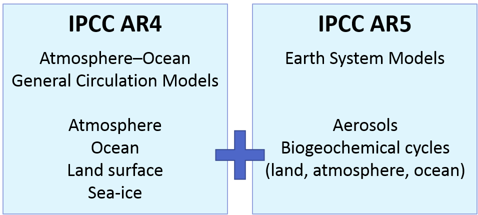

# `SpaDES` 3-day challenge
a workshop for the `SpaDES` user inside you

Featuring:
Drs. Eliot McIntire and Ceres Barros

## Workshop outline

**Day 1. What is SpaDES and how does it work?**
- Part I (morning): *User, this is SpaDES. SpaDES, meet your new best friend*
- Part II (afternoon): *Get your hands dirty: using `SpaDES` for the 1st time*

**Day 2.**

**Day 3.**

# Day 1. What is SpaDES and how does it work?
### Part I 
### *User, this is `SpaDES`. `SpaDES`, meet your new best friend* 

## Why is modelling important?

## Challenges modellers face
###(particularly when bridging disciplines)

#### 1. Many models, low integration

- Different models for a similiar question
- Varying model complexity

- Models in different languages

## Challenges modellers face
###(particularly when bridging disciplines)

#### 1. Many models, low integration

- Different models for a similiar question
- Varying model complexity

