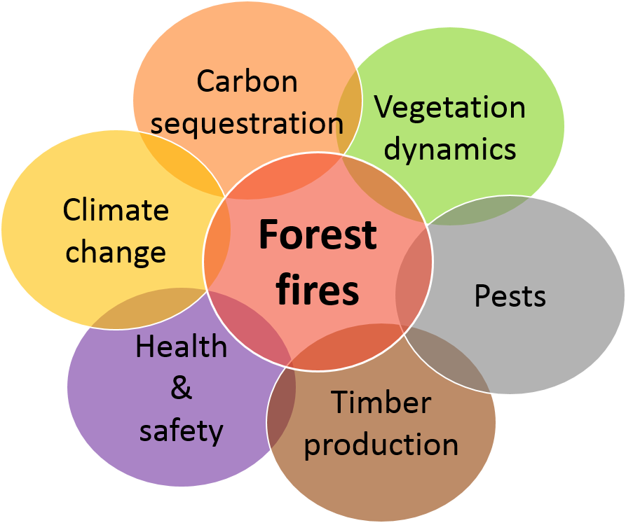

```{r setup, include=FALSE}
knitr::opts_chunk$set(echo = TRUE)
```

# **`SpaDES`** 3-day challenge
### a workshop for the `SpaDES` user inside you

Workshop outline:

* [**Day 1. What is SpaDES and how does it work?**](#Day1)
    + [Part I (morning). User, this is SpaDES. SpaDES, meet your new best friend](#PartI)
    + [Part II (afternoon). Get your hands dirty: using SpaDES for the 1st time](#PartII)
* [**Day 2.**](#Day2)
* [**Day 3.**](#Day3)

***

## <a name="Day1"></a>**Day 1. What is `SpaDES` and how does it work?**
### <a name="PartI"></a>**Part I. User, this is `SpaDES`. `SpaDES`, meet your new best friend**  

#### Why is modelling important?  
Models are nowadays so important and widespread that we often don't realize that most of what we use in our daily lives is the result of someone's (or some team's) model.  From weather forecasting, to predicting stock market fluctuonations. From the design of your bike, to the estimation of blood sugar and insuline levels and how they vary hourly and according to different diets (in case you don't know, this can be important for diabetes treatments, and drug dosage and scheduling)... 
Models are indeed 'everywhere'.  


#### Challenges modellers face  
In a world where disciplines often interact to study complex questions, like climate change, natural resource management, or even where to build an offshore wind farm, modellers (and model users!) face challenges that can impair scientific and social progress:  

1.  **Many models, low integration**
    + different scientific teams/individuals develop models to investigate the same question - which to choose?
    + these models sometimes vary in their degree of complexity - when is one more appropriate than the other?
    + and are often written in different programming languages, sometimes making their comparison, integration and development harder (especially for those who are not the model authors!)  

2.  **High complexity**
    + often solving a question, or problem, requires the cooperation of different teams, each contributing with distinct data and, possibly, models that need to be integrated;




3.  **Era of *big data* **
    + data availability and volume are increasing *FAST*;
    + today's model, will be outdated tomorrow -> models need to be constantly updated, revised and re-validated and re-calibrated.

4.  **Reproducibility and transparency**
    + one of the first premisses of scientific method is to repeat analyses and verify whether hypotheses hold in different conditions -> science *must* be reproducible in order to progress;
    + models (and modellers!) should be open to change and adaptation;
    + results and conclusions *must* be shared with stakeholders, managers, policy makers and the general public.

#### How do we tackle these issues? -> *continuous adaptive management*  
  
Continuous adaptive management is an existing framework that assumes a periodic re-assessment of the status of a situation or issue, e.g. the amount of waste a company produces. This leads to the design and implementation of new solutions - e.g. recycling paper or using rain water - their monitoring and evaluation, and their adjustment if need be, before the next assessment.  
  
In modelling terms, this framework implies that for a given problem/question analyses and forecasts are repeated as new data, new methodologies and new or improved models arise. This can lead to a re-assessment of risk, inform decisions and influence policy making. These can in turn feedback into the process of re-framing the initial problem/question.  
  
Although this framework is ideal, it is only seldomly applied across the scientific community.

Why? Because we are yet far from developing our research in a way that is easily repeatable, "upgradeable" and shareable. This renders the application of the continuous adaptive management framework costly, both temporally and financeally, especially in interdisciplinary projects that involve multiple teams and stakeholders.

  

#### Where do we go from here? **`SpaDES`!**
##### **What is `SpaDES`?**

`SpaDES` - *Spa*tial *D*iscrete *E*vent *S*imulator - is a modelling framework in the form of an ensemble of `R` packages. It aims to provide modellers and non-modellers across different domains of life and earth sciences (and beyond!) with a modelling tool that they can *control*, *apply* and *develop*. In its whole, `SpaDES` bridges the gaps between modellers and model-users of different disciplines, between scientists, practitionners, managers, stakeholders and policy makers, and between scientists and the general public.  

**How?**  
1. `SpaDES` is written in `R`: a widely understood programming language, highly suited to statistical analyses, but flexible and fast enough to accomodate simulation work;  
2. `SpaDES` can be used for a wide-range of modelling approaches:
    + process-based models;
    + phenomenological models;
    + spatially-explicit models;
    + ...
3. `SpaDES` models are built of *modules*, i.e. self-contained, interacting pieces that execute a particular *event*, or process in the model;
4. `SpaDES` modules can be made available across the entire `R` community if module-developers wish it so;
5. `SpaDES` will soon include a web-app builder to make interactive simulation possible.  

Like a smart-phone where users install and use the apps that they want, `SpaDES` can be seen as a platform where a model can be "assembled" from various pre-made modules. This allows non-modellers to run someone else's model on *their* data and *their* parameters, and, on the other hand, it allows modellers write their own modules from scratch, run them and share them with the `R` user community.  
  
##### **An example**
Our question(s): how will forest fires affect forest age? And how will climate change affect fire regimes and in turn the vegetation? How will timber supply be affected?  

**To start we'll need**  
* a vegetation dynamics module - e.g. [forestAge](https://github.com/PredictiveEcology/SpaDES-modules/tree/master/modules/forestAge);
* a fire simulator - e.g. [forestSuccessionBeacons](https://github.com/PredictiveEcology/SpaDES-modules/tree/master/modules/forestSuccessionBeacons) modules;
* optional:
    +   the interaction between fire and vegetation
    +   statistical analyses/presentation of results  

Depending on how modules are built, the interaction between modules may or may not require additional modules. Similarly, the presentation of results and their analyses can be directly made within the module producing them, or *as posteriori* using another module.  Your call. `SpaDES` is all about flexibility!  

Using the above mentioned modules would already allow an analysis of how fires affect forest age, and vice-versa. 

**Then add climate-change, timber supply models...**  
Analysing the effects of climate change could then be done by varying fire-related parameters (e.g. frequency and intensity of fires) in a simulation experiment. Alternatively, an additional module could simulate climate change effects, which would feedback unto both fire parameters and vegetation.  
Finally, a timber supply module could "read" the vegetation maps produced after fire simulations and calculate timber quantity and quality from forest conditions (e.g. surviving tree species and their age).  

**Reserve, add new data, and re-run**  
Provided that modules are able to download, read and treat data adequeatly, updating the simulations for new data is easy.  `SpaDES` comes with a set of functions (via the `reproducible` package) that enable caching model structure, parameters and simualtion results. This way, if new data only affects a section of the model, the user won't have to repeat every step to update the simulations.  

**Decorate and serve**  
Because models are not just for modellers, a shiny app building package is being developed to transform any `SpaDES` simulation into a web-app. This provides an interactive way of visualising results, as users can change simulation parameters and turn modules on and off, whilst observing how this impacts simulation results. Importantly, it can be particularly useful when conveying results to a non-expert or even the public.  

Shiny web-app demo [here](https://spades.shinyapps.io/ForestChange_ProofOfConcept/) and [here](http://landweb.predictiveecology.org/Demo/)

***
***

### <a name="PartII"></a>**Part II. Get your hands dirty: using SpaDES for the 1st time**  

**Table of contents:**  
[**Exercise 1. `SpaDES` in action`**](#Exercise1)  

* [1.1 Installing `SpaDES`](#InstallSpaDES)  
* [1.2 Modules included in the `SpaDES` package](#SpaDES_modules)   
* [1.3 Simulation modelling with `SpaDES`](#ModellingSpaDES)
    + [1.3.1 Download modules](#DownloadModules)
    + [1.3.2 Simulation set-up](#SetupSim)
    + [1.3.3  Simulation object - `simList`](#simList)
    + [1.3.4 Running a `SpaDES` simulation](#runSim)
    + [1.3.5 1.3.5 Change model parameters without restarting](#changeParams)
    
#### <a name="InstallSpaDES"></a>**1.1 Installing `SpaDES`**  

`SpaDES` groups a series of `R` packages - *metapackage* - containing both core and additional methods to design a discrete event simulation model:  

* SpaDES.core - contains the core simualtion components  
* reproducible - contains caching methods  
* quickPlot - contains methods for better visualisation of results  
* SpaDES.tools & SpaDES.addins - contain useful tools and additional methods, such as a spread function and utilities to create new modules from templates.  
* SpaDES.shiny - under development. Will provide a set of methods to build shiny apps from simulation objects.  

Prior to installing `SpaDES` make sure you have:

1. an **up to date version of `R`** - having RStudio, or another `R` editor might also be useful.  
2. the package `devtools` installed  
3. [**Rtools**](https://cran.r-project.org/bin/windows/Rtools/) (Windows), [**XCode**](http://itunes.apple.com/us/app/xcode/id497799835?mt=12) (Mac), or r-base (Linux; please see [here](https://support.rstudio.com/hc/en-us/articles/200486498-Package-Development-Prerequisites) for details).  


`SpaDES`is still on a relatively steep development curve. As such, it might be sometimes necessary to update a particular package from GitHub (where `SpaDES` is being developed). It might be important to keep an eye on new improvements present in GitHub that might not be in CRAN yet. You'll find the lastest releases for each package in their respective GitHub page (e.g. [SpaDES.core releases](https://github.com/PredictiveEcology/SpaDES.core/releases)). If you go to the [commits page](https://github.com/PredictiveEcology/SpaDES.core/commits/development) you'll notice that that there might be new features relatively to the latest commit.  

```{r SpaDESinstall}
## Install all packages and their dependencies first
install.packages('SpaDES', dependencies = TRUE)

## now, update some of the packages from the development branch.
devtools::install_github('PredictiveEcology/SpaDES.core@development')
devtools::install_github('PredictiveEcology/reproducible@development')

## and load SpaDES
library(SpaDES)
```

#### <a name="SpaDES_modules"></a>**1.2 Modules included in the `SpaDES` package**  

```{r sampleModuleDir}
## Locate the sample modules in SpaDES.core
sampleModuleDir <- system.file('sampleModules', package = 'SpaDES.core')
    
## list the modules in this directory
dir(sampleModuleDir)
```
  
**What do these modules do?**  

```{r sampleModuleFiles}
## open the sample module Rmd file to learn more about the modules and access a simple example
sampleModuleFiles <- list.files(sampleModuleDir, pattern = 'Rmd$', recursive = TRUE, full.names = TRUE)
    
lapply(sampleModuleFiles, file.edit)
```
  
All modules should come with an *.Rmd* file that provides a summary of how the module works and *reproducible* example. If you've ever searched for R-help on **stackoverflow** you'll have noticed how peope try to provide `R` code that can be run in any machine to reproduce the problem/solution at hand. Module *.Rmd* files should also run in any machine.

  
#### <a name="ModellingSpaDES"></a>**1.3 Simulation modelling with `SpaDES`**   

Let's go back to the modelling question discussed briefly above.  

Our first objective is to simulate the the effect of fire on forest age. There are two main components to such a model, which need to interact:
1. a fire simulator
2. a forest age simulator  


##### <a name="DownloadModules"></a>**1.3.1 Download modules**   

The `LCC2005` module group provides a set of modules that can reproduce these dynamics (in a simple way).  

Let's define the working directories of our simulation exercice (*SpaDESintro*) first.  

```{r def_dirs}

## We'll create the necessary directories in a temporary location - feel free to change this if you wish to.
setPaths(cachePath = file.path(tempdir(),'SpaDESintro/cache'),
         inputPath = file.path(tempdir(), 'SpaDESintro/inputs'),
         modulePath = file.path(tempdir(), 'SpaDESintro/modules'),
         outputPath = file.path(tempdir(), 'SpaDESintro/outputs'))

## verify that this is want you wanted:
getPaths()
```

Now we'll get `LCC2005` modules needed and save them in the `modules` folder created before. If you already have done this before and want to do it again, set the `overwrite` argument to `TRUE`.  
Using `data = TRUE` will make sure the necessary data for the module is downloaded. Unfortunately, the forest age raster is no longer downloadable without creating an account on the NASA EarthData website (if you wish to do so, you can access the file "can_age04_1km.tif" [here](https://daac.ornl.gov/NACP/guides/NA_Tree_Age.html) and download it *after* you've logged in). 


```{r module_downld}
## Not run (use if API limit is exceeded)
# ops <- options(spades.useragent = "http://github.com/CeresBarros/SpaDES-modules")

## note how we use the modules folder defined above and chose to download the necessary data
downloadModule('LCC2005', path = getPaths()$modulePath, repo = 'PredictiveEcology/SpaDES-modules', data = TRUE, overwrite = TRUE)

# options(ops)

## open the description of the LCC2005 module group - on Windows, this provides files directories
openModules('LCC2005', path = getPaths()$modulePath) 

## list all module files within LCC2005 and open them
LCC2005ModuleFiles <- list.files(getPaths()$modulePath, pattern = 'Rmd$', recursive = TRUE, full.names = TRUE)

## open module Rmd files
lapply(LCC2005ModuleFiles, file.edit)
```
  
As you can see, `LCC2005` is a module group, meaning that it contains several modules that work together. Find more about module structure [here](http://spades-workshops.predictiveecology.org/articles/Modules--Thinking-in-a-modular-way.html) and [here](http://spades-workshops.predictiveecology.org/articles/Module-details.html).  

In this exrecise, we will follow a simpliflied version of the example contained in the `LCC2005.Rmd` file. We will only use the modules necessary to simulate vegetation dynamics (`cropReprojectLccAge`, `forestAge`, `forestSuccessionBeacons` and `LccToBeaconsReclassify`) and fire spread (`fireSpreadLcc`).

##### <a name="SetupSim"></a>**1.3.2 Simulation set-up**  

```{r LCC2005_setup}
## We've defined the paths earlier 
paths <- getPaths()

## we'll several, but not all the modules in LCC2005
modules <- list("cropReprojectLccAge", "fireSpreadLcc", "forestAge", "forestSuccessionBeacons", "LccToBeaconsReclassify")

## we don't need to suply external objects
objects <- list()

## define the starting and end times of the simulation
times <- list(start = 1.0, end = 20.0)

parameters <- list(
  .globals = list(stackName = "landscape", burnStats = "nPixelsBurned"),
  .progress = list(NA),
  fireSpreadLcc = list(nFires = 10L, drought = 1, its = 1e6,
                    persistprob = 0, returnInterval = 10, startTime = 0,
                    .plotInitialTime = 0.1, .plotInterval = 10)
)

## build the simulation object
mySim <- simInit(times = times, params = parameters, modules = modules,
                 objects = objects, paths = paths)
```

##### <a name="simList"></a>**1.3.3 Simulation object - `simList`**  

The object `mySim` contains all the necessary information to run the simulation, such as the objects that are shared between modules, and how these are linked between them. It's called a `simList`. You can find out more about the `simList` object [here](http://spades-workshops.predictiveecology.org/articles/The-simList.html)

Let's have a look at what mySim contains and how modules are connected.

```{r mysim}
## list the contentes of mySim
ls.str(mySim)

## plot module connections
moduleDiagram(mySim)
objectDiagram(mySim)
```


##### <a name="runSim"></a>**1.3.4 Running a `SpaDES` simulation**  

Now that we've checked the structure of our simulation model, we can go ahead and run it.

```{r run_spades}
clearCache()
dev() # to open a new plot device for faster plotting
clearPlot()
spades(mySim, debug = TRUE)   # set debug = TRUE to print simualtion steps.
```
  

##### <a name="changeParams"></a>**1.3.5 Change model parameters without restarting** 

```{r run_sim2}
times$start = 21; times$end <- 40
mySim@params$fireSpreadLcc$drought <- 3


mySim <- spades(mySim, debug = TRUE)
```
  
Why "overwrite" `mySim`? Explain

```{r run_sim2}
## add more time, change drought parameter while continuing the simulation.
## change fire regimes
mySim <- spades(mySim)
```
  
Run experiment with different fire regimes (? maybe too advanced?)
```{r experiment}

```

Now add a management/caribou movement (?) model your colleague designed...


# `SpaDES` and `shiny`

If time permits, feel free to play around with the proof-of-concept shiny apps:

- https://spades.shinyapps.io/ForestChange_ProofOfConcept/
- http://w-vic-a105388.pfc.forestry.ca/SpaDESUI-forEliot-Oct2016/ (only available inside CFS firewall)


