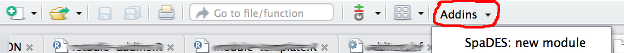

```{r setup, include=FALSE}
knitr::opts_chunk$set(cache = TRUE, echo = TRUE, eval = FALSE)
library(SpaDES)
```

## Getting started with `SpaDES`

- Our [Getting Started Guide](https://github.com/PredictiveEcology/SpaDES/wiki/Getting-Started-Guide) is available from the wiki.

- The [modules vignette](http://spades.predictiveecology.org/vignettes/ii-modules.html) contains much more detail.

## Finding `SpaDES` tools

### Categorized overview of the `SpaDES` package

```{r, spades-tools, echo=TRUE, eval=FALSE}
?SpaDES
```

1. Spatial discrete event simulation (`SpaDES`)
2. Module functions
3. Plotting
4. File operations
5. Sample data and modules included in package


## Anatomy of a `SpaDES` module

### Directory structure

```{r sample-module-dir, eval=FALSE, echo=TRUE}
module.path <- file.path(dirname(tempdir()), "modules")
downloadModule('wolfAlps', module.path, data = TRUE)
list.files(file.path(module.path, 'wolfAlps'), all.files = TRUE)
```

```
/moduleRepository
  |_ moduleName/
      |_ R/                     # contains additional .R (helper) files
      |_ data/                  # directory for all included data
          |_ CHECKSUMS.txt      # contains checksums for data files
      |_ tests/                 # contains unit tests for module code
      |_ citation.bib           # bibtex citation for the module
      |_ LICENSE.txt            # describes module's legal usage
      |_ README.txt             # provide overview of key aspects
      |_ moduleName.R           # module code file (incl. metadata)
      |_ moduleName.Rmd         # documentation, usage info, etc.
      |_ moduleName_x.y.z.zip   # zip archive of previous versions
```

**Advanced:** not included (yet) in the main module repo are examples of modules that include unit tests and code coverage.

These are *encouraged* and can be built using:

```{r testing, echo=TRUE, eval=FALSE}
# when creating a new module
newModule(..., unitTests = TRUE) # default

# or after-the-fact with
newModuleTests(...)
```

### Code file structure

```{r sample-module-code, eval=FALSE, echo=TRUE}
samplePath <- system.file('sampleModules', package = 'SpaDES')
openModules('randomLandscapes', samplePath)
```

A module code file (`.R`) consists of the following key sections:

1. module metatadata (`defineModule` block)

2. definitions of each module event type (`doEvent.moduleName` block)

3. additional functions used in the events above

4. (optional) block of code that is run during module initialization, used to perform additional data processing/transformation steps (`.inputObjects` block)

## New module template

The `newModule` function creates a module template for you to edit to suit your needs:

```{r new-module, echo=TRUE, eval=FALSE}
newModule('moduleName', file.path('path/to/my/module/directory'))
```

Alternatively, use the RStudio addin which is simply a GUI wrapper for this function:



## Module metadata

Each module requires a collection of metadata describing the module, its dependencies, and linking to documentation, etc.

These metatadata are defined in the `defineModule` code block at the start of the file, and are intended to be both human and machine readable.

```{r metadata, echo=TRUE, eval=FALSE}
## see section 'Required metadata elements'
?defineModule
```

### Module parameters

*Parameters* defined in the module's `defineParameter` block are module-specific.

This is where default parameter values are specified (which can be overridden by the user during `simInit()`).

They can be accessed using `params(sim)$module$param` or `P(sim)$param`.
**The latter is context-dependent!**

### Data dependencies

The `inputObjects` and `outputObjects` metadata fields specify a module's inputs and outputs respectively.

**These refer to R objects, rather than raw data files.**

### Working with data

- data can be bundled directly with your module or can be hosted externally
- `sourceURL` field in module metadata is used for URLs of external data, which are downloaded using `downloadData()`
- checksums are to verify file integrity of the data (*e.g.*, in case of download error or change in the data file)

## Module events

- Each module may contain an arbitrary number of event types.
- Each event consists of two parts:

    1. what to do right now;
    2. what to do later (via `scheduleEvent()`)

- To keep this section as easy to read as possible, use additional module functions (defined in the section below).

## Additional module functions

- Should get and return objects in the simulation environment (`envir`), rather than pass them as function arguments.
- Accessing objects in `envir` is similar to accessing items in a list, *i.e.*, `sim[["object"]]` or `sim$object` can be used.
- To ensure unique function names, follow the naming convention `modulenameEventtype()`.

## The `.inputObjects` block (*optional*)

- How do we provide default data for a module?

- Once we have defined what the module is looking for (in the `inputObjects` block of `defineModule`), we may want to supply a default data set or links to raw data sources online

- See `?defineModule` and `?inputs` for details.
- Sequence to fill simList with data, each subsequent one will override the previous:

1. `.inputObjects` function in module
2. `objects` argument in `simInit`
3. `inputs` argument in `simInit`

- *So remember if the user passes data manually in the `simInit`, it will override the defaults*


## Visualizations

`SpaDES` builds on R's exceptional graphics capabilities, and the standard R visualization packages etc. can be used with `SpaDES`.

However, for fast prototyping and on-the-fly graphics useful for module debugging and development you should use `Plot()`.

    - much faster than base graphics, ggplot, etc.
    - modular plotting (automatic multipanel layouts)

**WARNING:** The built-in RStudio plotting device is heinously slow!

```{r new-plot-device, echo=TRUE, eval=FALSE}
if (getOption('device') == 'RStudioGD') dev.useRSGD(FALSE)
dev()
```

## `Plot`ting

See the [plotting vignette](http://spades.predictiveecology.org/vignettes/iii-plotting.html) and `?Plot` for more detailed examples.

```{r Plotting, echo=TRUE, eval=FALSE}
Plot(...)
clearPlot()

Plot(..., new = TRUE)
Plot(..., addTo = objectName) ## adds to existing plot

rePlot() ## useful after plot device is resized

## see also
colors(...) ## get and set raster colors
```

## Event-level plotting

Module-specific plot parameters can be used to control plotting for your event: `.plotInitialTime` and `.plotInterval`.

*E.g.*, schedule a recurring plot event within a module:

```{r plotting, echo=TRUE, eval=FALSE}
nextPlot <- time(mySim) + SpaDES::p(mySim)$.plotInterval
mySim <- scheduleEvent(mySim, nextPlot, "moduleName", "plot")
```

## Interacting with plots

See http://spades.predictiveecology.org/vignettes/iii-plotting.html#interacting-with-plots

- `clickValues()`
- `clickExtent()`

## Saving

- http://spades.predictiveecology.org/vignettes/ii-modules.html#load-and-.save-modules

    - `.saveObjects`
    - `saveFiles()`

*E.g.*, schedule a recurring save event within a module:

```{r saving, echo=TRUE, eval=FALSE}
nextSave <- time(mySim) + SpaDES::p(mySim)$.saveInterval
sim <- scheduleEvent(mySim, nextSave, "moduleName", "save")
```

## Loading

- http://spades.predictiveecology.org/vignettes/ii-modules.html#load-and-.save-modules

## Checkpointing

Checkpointing is build into `SpaDES` automatically and can be turned on at the *simulation* level (not the module level).

```{r checkpoint, eval=FALSE, echo=TRUE}
parameters <- list(
  .checkpoint = list(interval = 10, file = "chkpnt.RData")
)

mySim <- simInit(..., params = parameters)
```

See [vignette](http://spades.predictiveecology.org/vignettes/ii-modules.html#checkpoint-module
) for more details.

**NOTE** don't checkpoint *too* often, or your simulation will slow down too much (disk writes are slow).

## Debugging

- using `spades(sim, debug = TRUE)`

- adding `browser()` calls to your module code

- using the Rstudio debugger

See debugging info at the [wiki](https://github.com/PredictiveEcology/SpaDES/wiki/Debugging).

## Summary statistics

See [this wiki entry](https://github.com/PredictiveEcology/SpaDES/wiki/Summary-statistics-in-simulations).

1. Add a new module parameter and output to the module metadata.

2. Add a 'summarize' event.

3. Add an new event function that calculates the statistic(s) of interest.

4. Update your module's `reqdPkgs` metadata field if you are using additional packages.

## Module development checklist

\*Adapted from the [one on the wiki](https://github.com/PredictiveEcology/SpaDES/wiki/Getting-Started-Guide#module-development-checklist).

### Metadata

- [ ] are module metadata fully and correctly specified (module description, authorship and citation info, parameters and inputs/outputs, etc.)?
- [ ] citation should specify how to cite the module, or if published, the paper that describes the module.
- [ ] module object dependencies: use `moduleDiagram` and `objectDiagram` to confirm how data objects are passed among modules.

## Module development checklist

\*Adapted from the [one on the wiki](https://github.com/PredictiveEcology/SpaDES/wiki/Getting-Started-Guide#module-development-checklist).

### Events

- [ ] are all event types defined in doEvent?
- [ ] use `sim$function(sim)` to access event functions
- [ ] `use sim$object` to access simulation data objects
- [ ] use *e.g.*, `sim[[globals(sim)$objectName]]` to access variable-named objects
- [ ] use unique function names to reduce the risk of another module overwriting your functions. *E.g.*, use `moduleNameFunction()` instead of `function()`.
- [ ] using `sim$function` notation is not required for the definition of event functions

## Module development checklist

\*Adapted from the [one on the wiki](https://github.com/PredictiveEcology/SpaDES/wiki/Getting-Started-Guide#module-development-checklist).

### Documentation

- [ ] have you provided useful (meaningful) documentation in the module's `.Rmd` file and `README`?
- [ ] have you built (knitted) the `.Rmd` file to generate a `.pdf` or `.html` version?
- [ ] have you specified the terms under which your module code can be reused and/or modified? Add a license!

## Module development checklist

\*Adapted from the [one on the wiki](https://github.com/PredictiveEcology/SpaDES/wiki/Getting-Started-Guide#module-development-checklist).

### Data

- [ ] verify that data you wish to include with your module are saved in `data/`
- [ ] verify that external data sources are included in the `sourceURL` metadata field
- [ ] verify that any additional data preparation/transformation steps used in `.inputObjects` are correct
- [ ] write `CHECKSUMS.txt` file for all data using `checksums(..., write = TRUE)`

## Module development checklist

\*Adapted from the [one on the wiki](https://github.com/PredictiveEcology/SpaDES/wiki/Getting-Started-Guide#module-development-checklist).

### Distributing your module

- [ ] where will your module code/data be hosted?
- [ ] test `downloadModule` and `downloadData` from a temp dir to ensure your module can be downloaded correctly by others
